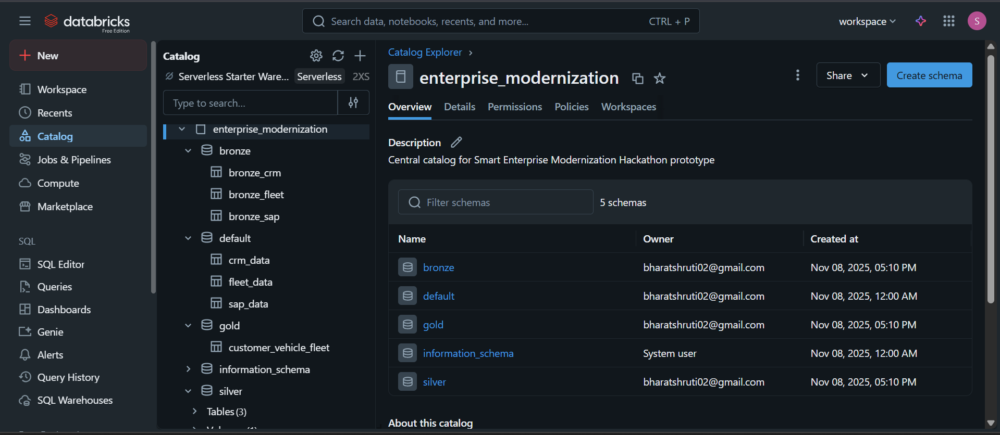

# 🚗 Smart Enterprise Modernization Hackathon

Welcome to a unified cloud analytics platform that brings **enterprise fleet operational data to life**—from raw feeds to actionable dashboards and AI predictions—using Databricks Lakehouse, Delta Lake, and MLflow.

---

## ⭐ What Makes This Project Unique?

- Real-time, multi-source ingestion (APIs, S3, IoT)
- Automated and auditable ETL pipeline (Bronze → Silver → Gold)
- Full ML lifecycle: training, tuning, registry, serving
- Live business dashboards for KPIs & trends
- AI chatbot and API endpoint code ready for plug-and-play extensibility

---

## 🧩 Project Overview

This project is a modular, end-to-end solution divided into the following parts:

- **Data Ingestion:** Collects and simulates vehicle fleet data from diverse sources like REST APIs, CSV files, and IoT simulators.
- **Data Transformation:** Cleanses raw data and applies Delta Lake ETL pipelines to create curated feature-rich datasets.
- **AI Layer:** Trains and manages machine learning models with MLflow and prototypes an AI-powered chatbot to provide natural language insights.
- **API Export:** (Upcoming) Planning a unified API layer for seamless access to data and AI predictions.
- **Dashboard Visualization:** Interactive dashboards creating meaningful KPI visualizations for business stakeholders.

---

## ⚙️ Technology Stack

- **Languages:** Python, PySpark, SQL
- **Frameworks & Tools:** Databricks, Delta Lake, MLflow, FastAPI (for APIs), Lakeflow
- **Cloud & Storage:** AWS S3, IAM, Databricks Lakehouse
- **Data & Visualization:** Databricks SQL Dashboards, Databricks Notebooks

---

## 🏗️ Architecture at a Glance

*This diagram shows how raw data flows through ETL, ML modeling, and visualization before powering API/chatbot endpoints.*

---

## 📚 Data Layers (Medallion Architecture)

| Layer   | Tables                | What’s here?                        |
|---------|-----------------------|-------------------------------------|
| Bronze  | Raw source tables     | Ingested SAP, CRM, Fleet/IoT data   |
| Silver  | Cleaned, conformed    | Duplicate removal, schema checks    |
| Gold    | Analytics tables      | Business metrics, ML-ready datasets |

Data moves from [Bronze] **raw** → [Silver] **cleansed** → [Gold] **analytics-ready**, supporting traceability and rapid queries.

---

## ⚙️ Pipeline Stages (with Images)

**Ingestion:**  
Pulls data from SAP APIs, CRM CSVs on S3, and simulated IoT feeds.

**Transformation:**  
Cleans, validates, and joins all sources; output is the Silver layer.

**Modeling:**  
Trains/versions ML models with MLflow, stores artifacts in S3, deploys with Databricks Model Serving.

**Dashboards:**  
Final Gold tables power live dashboards with direct business KPIs.

---

## 🤖 Future-ready Extensions

- **AI Chatbot & API:**  
  Code included for a natural language data assistant (ChatGPT/OpenAI) and FastAPI endpoints—easily deployable when API keys and schedule permit.

---

## 🛠️ Project Structure

Smart-Enterprise-Modernization-Hackathon/
├── Notebooks/
├── Unity_Catalog/
├── MLflow/
├── Dashboards/
├── Serving/
├── AWS/
├── requirements.txt
├── README.md

---

## 🚀 Quickstart

1. Clone the repo, import notebooks to Databricks.
2. Set up Unity Catalog, MLflow, S3 credentials.
3. Run ETL, train a model, and explore dashboards.
4. (Optionally) Deploy the chatbot or API endpoint.

---

## 🏆 Achievements & Highlights

- Efficient ETL pipeline built with Delta Lake for scalable and reliable data curation.
- Integrated MLflow for robust experiment tracking and model lifecycle management.
- Developed an AI chatbot prototype leveraging Large Language Models to answer natural language queries.
- Modular architecture enabling incremental upgrades and scalable feature additions.

---

## 🤝 Collaboration & Contribution

Contributions, issues, and feature requests are welcome! Feel free to open issues or submit pull requests for improvements.

---

## 📫 Contact

**Shruti Bharat**  
📧 bharatshruti02@gmail.com  
🌐 [LinkedIn](https://www.linkedin.com/in/Shruti_Bharat) | [GitHub](https://github.com/shrutibharat01)

---

