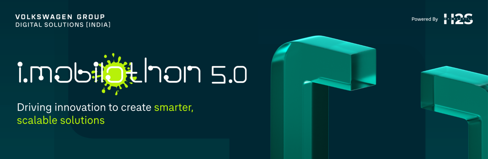
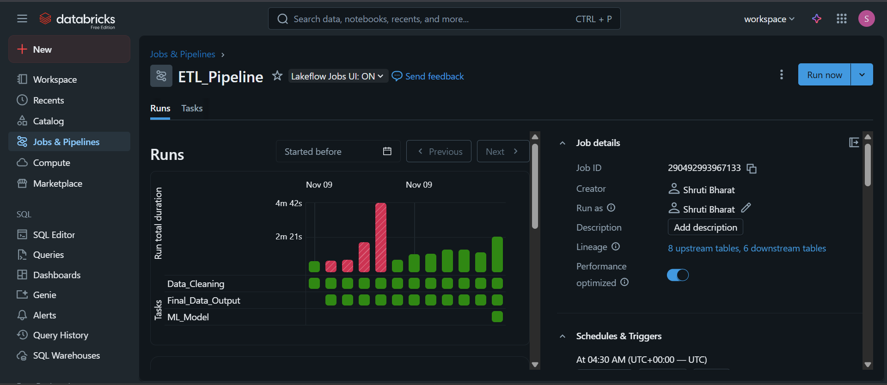
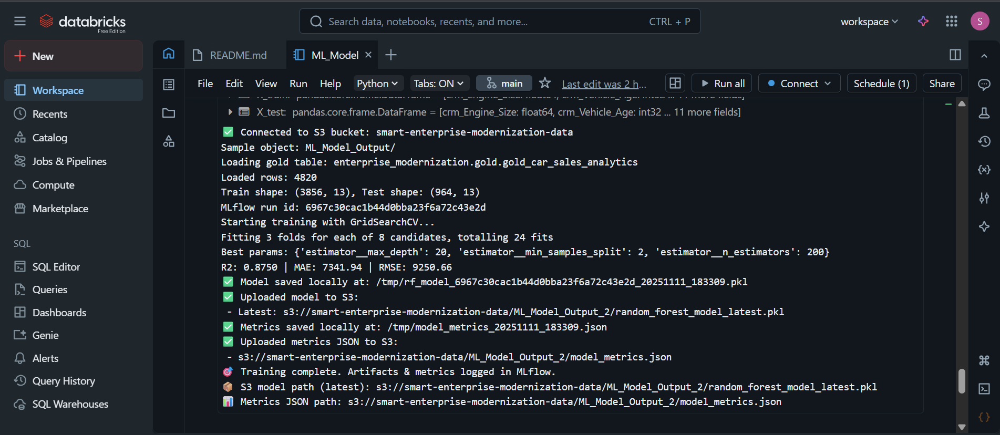
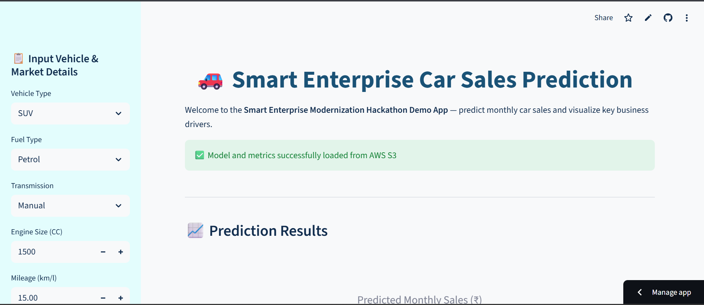
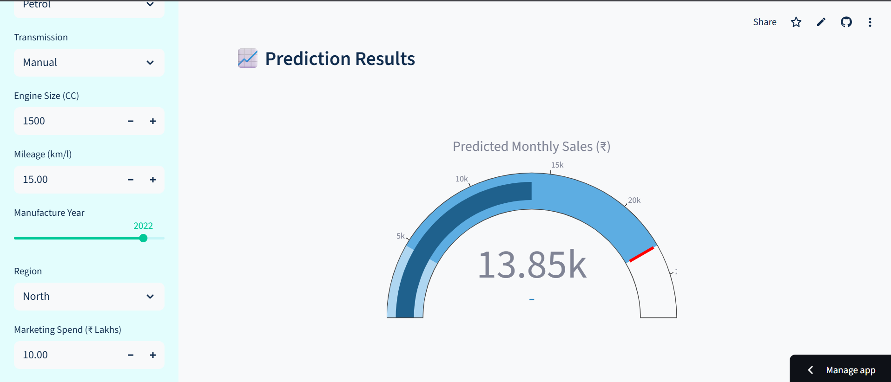
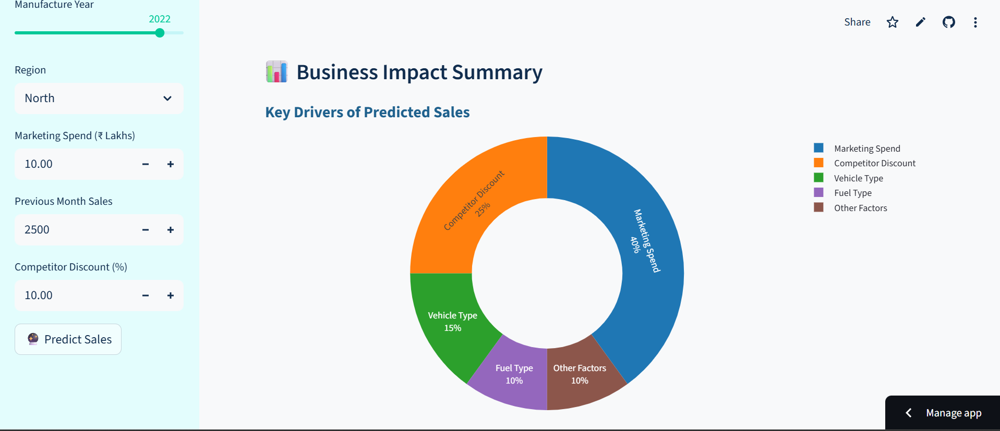
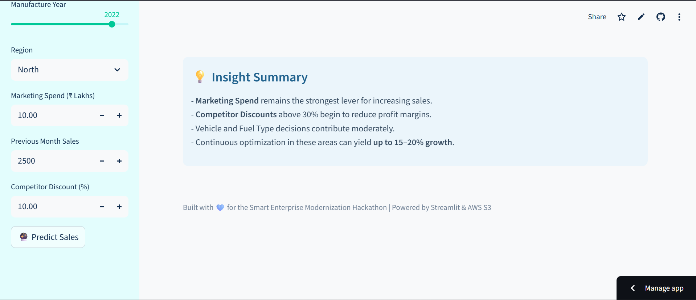
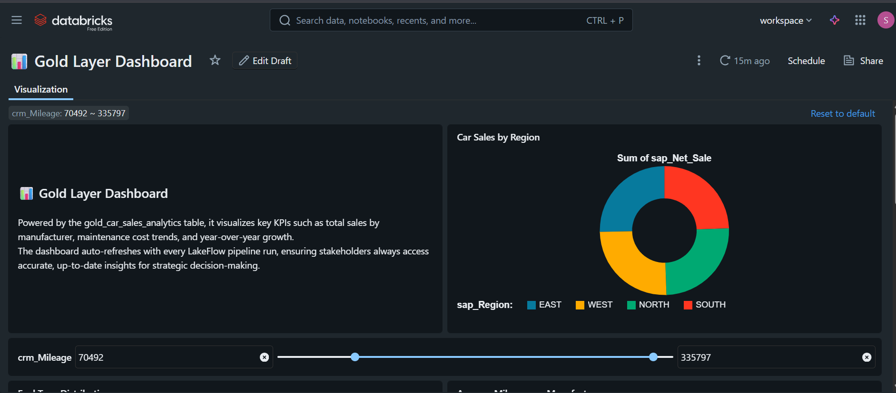
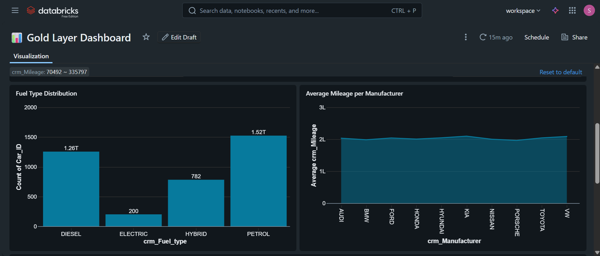
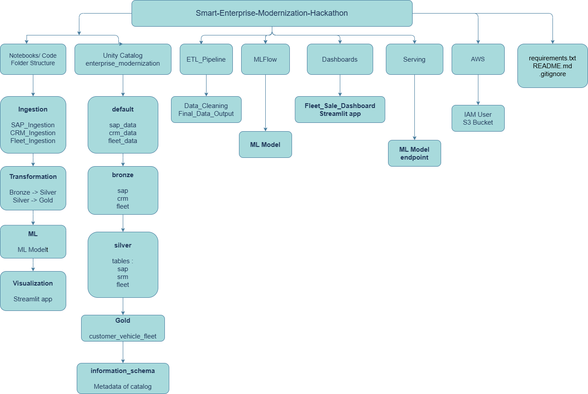

<h1>🚗 Smart Enterprise Modernization – End-to-End Data & AI Pipeline</h1>

<p>
  <i>Submission for <a href="https://vision.hack2skill.com/event/imobilothon-5">IMOBILOTHON 5.0 Hackathon</a> organized by Hack2Skill</i><br>
  <b>Built using Databricks • AWS S3 • Streamlit • Machine Learning • SQL Dashboard</b>
</p>

---

<p>
  
</p>

---

## 🧠 Project Overview

This project demonstrates a **modernized enterprise data and AI pipeline** that unifies multiple automotive datasets — **SAP**, **CRM**, and **Fleet** — through the **Medallion Architecture (Bronze → Silver → Gold)** using **Databricks Lakehouse**.

Once aggregated into the **Gold Layer**, the data powers a **Machine Learning model (Random Forest Regression)** to predict **car sales performance** and feeds two downstream analytics layers:
- 🎯 **An interactive Streamlit dashboard** (powered by AWS S3 artifacts)
- 📊 **A Databricks SQL dashboard** for business insights


---

### 🚀 Live Project Links

| Platform | Description | Link |
|-----------|--------------|------|
| 🌐 **Streamlit App** | Interactive UI for real-time car sales prediction | [Launch App](https://requirementstxt-sifacvjjeifdr4kdnjkdjd.streamlit.app/#profit-sensitivity-overview) |
| 📊 **Databricks SQL Dashboard** | Real-time analytics on Gold Layer (Sales, Fleet, Region) | [View Dashboard](https://dbc-153742af-261e.cloud.databricks.com/dashboardsv3/01f0bf40fcd41678a9f3b2f0aad7aaf4/published?o=2287075381141686&f_page1%7E9aaa3ae5=70492%7E335797) |

> 🪶 *Note: Both dashboards are live and auto-refresh based on LakeFlow pipeline runs.*


---

## 🏗️ Architecture Overview

<p>
  
</p>

### 💎 Medallion Architecture

| Layer | Description | Technology |
|--------|--------------|-------------|
| 🥉 **Bronze Layer** | Raw ingestion of CRM, SAP, and Fleet data into Delta tables. | Databricks Delta Tables |
| 🥈 **Silver Layer** | Cleaned, deduplicated, and standardized data transformation. | Spark SQL & PySpark |
| 🥇 **Gold Layer** | Aggregated business view combining all sources for ML & BI. | Delta Lake / Databricks SQL |

---

## 🔁 End-to-End Project Flow

<p>  </p>

---

## ⚙️ ETL Workflow
<p>  </p>

### Data Sources:
- CRM: Customer and vehicle details
-  SAP: Financial and regional sales records
- Fleet: Vehicle usage, maintenance, and performance data

---

### Transformation Stages:
1. 🥉 **Bronze Layer – Raw Ingestion**  
   Landing zone for raw data from all systems (SAP, CRM, and Fleet).  
   - Captures data as-is from various enterprise sources  
   - Ensures immutability and traceability  

2. 🥈 **Silver Layer – Transformation**  
   Cleansed and standardized layer for consistent schema and quality data.  
   - Handles missing values and data type conversions  
   - Removes duplicates and invalid records  
   - Applies business logic transformations  

3. 🥇 **Gold Layer – Aggregation**  
   Curated layer used for analytics, machine learning, and reporting.  
   - Merges CRM, SAP, and Fleet data into a unified dataset  
   - Aggregates KPIs and business metrics  
   - Optimized for query performance in Databricks SQL  

**Automation:** All transformations orchestrated via **Databricks LakeFlow** and executed on **Delta Tables** to ensure reliability, scalability, and incremental updates.

----

# 🚗 Smart Enterprise Modernization - Car Sales Analytics

## 🤖 Machine Learning Model (Random Forest Regression)
<p align="center">
  
</p>

**Input:** Gold layer table — `enterprise_modernization.gold.gold_car_sales_analytics`  
**Target:** `crm_Price` (vehicle sales)  
**Algorithm:** Random Forest Regressor  
**Optimization:** GridSearchCV  
**Experiment Tracking:** MLflow  
**Model Artifacts:** Saved to AWS S3 as `model.pkl` and `model_metrics.json`

### Evaluation Metrics

| Metric | Description |
|---------|--------------|
| RMSE | Root Mean Squared Error (used as confidence interval) |
| MAE | Mean Absolute Error |
| R² | Model performance score |

---

## ☁️ Cloud Integration: AWS S3 + Streamlit
<p>
  
</p>

<p>
  
</p>

<p>
  
</p>

<p>
  
</p>

----

| Component | Description |
|------------|--------------|
| 🪣 **AWS S3** | Stores trained model artifacts and metrics |
| 💻 **Streamlit** | Interactive app for live sales prediction |
| 🔐 **Secrets.toml** | Manages AWS credentials securely |
| 🔮 **Streamlit Features** | Sidebar-based feature inputs, centralized prediction output, confidence interval display, donut chart visualization, and a responsive UI |

---

## 📊 Databricks SQL Dashboard
<p>
  
</p>


<p>
  
</p>


----

**Powered by Gold Layer Aggregation**

### Dashboard KPIs:
- 🚘 Total Sales by Region  
- 💰 Average Fleet Maintenance Cost  
- 🏭 Manufacturer-Wise Performance  
- 📈 Year-over-Year Growth  

Auto-refreshes with every **LakeFlow ETL** run.

---

## 🧩 Tech Stack

| Category | Tools / Services |
|-----------|-----------------|
| 💾 Data Ingestion | Databricks Delta Tables, Spark |
| 🧹 Transformation | PySpark, SQL, LakeFlow, Python |
| 🧠 Machine Learning | Scikit-learn, MLflow, ML |
| ☁️ Cloud Storage | AWS S3, IAM |
| 💡 Visualization | Streamlit, Plotly, Databricks SQL |
| 🔐 Credentials | Streamlit Secrets.toml |

---

## 🧮 Pipeline Summary

| Step | Layer | Description | Output |
|------|--------|--------------|---------|
| 1️⃣ | Bronze | Raw data ingestion | CRM, SAP, Fleet tables |
| 2️⃣ | Silver | Transformation & cleaning | Standardized dataset |
| 3️⃣ | Gold | Aggregation for analytics | Unified gold table |
| 4️⃣ | ML | Random Forest Regression | `model.pkl`, `metrics.json` |
| 5️⃣ | Visualization | Dashboards | Streamlit & Databricks SQL |

---

## 📂 Repository Structure

```
Smart-Enterprise-Modernization-Hackathon/
│
├── Notebooks/
│   ├── Ingestion/                          
│   │   ├── SAP_Ingestion_Notebook.py       
│   │   ├── CRM_Ingestion_Notebook.py       
│   │   └── Fleet_Ingestion_Notebook.py     
│   │
│   ├── Transformation/                    
│   │   ├── Bronze_To_Silver_Notebook.py    
│   │   └── Silver_To_Gold_Notebook.py  
│   │
│   ├── ML/
│       └── ML_Model.py
│    
│   
├── streamlit_app/
│   ├── app.py
│   └── .streamlit/secrets.toml
│
│
├── Utils/
│   ├── hackathon_banner.png
│   ├── medallion_architecture.png
│   ├── etl_pipeline.png
│   ├── ml_training.png
│   ├── streamlit_dashboard.png
│   ├── databricks_sql_dashboard.png
│   └── architecture_summary.png   
│ 
│  
├── Databricks_Architecture/
│   ├── Delta_Lake_Catalog/
│   │   ├── bronze
│   │   ├── silver       
│   │   └── gold   
│   ├── MLflow/
│       ├── Experiments/
│       ├── Registered_Models/
│       └── Model_Artifacts/
│
│
├── Dashboards/
│ └── Fleet_Sales_Dashboard.sql
│
├── requirements.txt
├── runtime.txt
├── README.md
└── .gitignore

```

---

## 🌐 Architecture Summary
<p>
  
</p>

---

## ✨ Future Enhancements
- 🔁 Integration with AWS Glue Data Catalog  
- ☁️ Deploy model via Databricks Model Serving  
- 📱 Multi-page Streamlit dashboard  
- 📊 Real-time Gold layer sync using LakeFlow triggers  

---

## 👩‍💻 Developed By

**Shruti Bharat**  
Data Engineer • Machine Learning Enthusiast • Hackathon Innovator  
[GitHub](https://github.com/shrutibharat01) • [LinkedIn](https://www.linkedin.com/in/shrutibharat)  

<p>
  <i>Built with 💙 for the Smart Enterprise Modernization Hackathon • Transforming Data into Intelligence 🚀</i>
</p>
```
